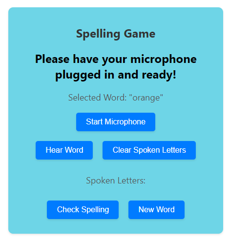

  
  # CML120 Test application

  ## Project Description
  This is purely a test app to experiment with speech to text and text to speech functionality.  
  This project was made using the annyang javascript speech library and Web Speech API's SpeechSynthesis.
  Sources:  
  [annyang](https://www.npmjs.com/package/annyang)  
  [SpeechSynthesis](https://developer.mozilla.org/en-US/docs/Web/API/Web_Speech_API)  
 

   
  
  ## Contact
  Please contact [CML120](https://github.com/CML120) at cheelor922@gmail.com with any questions.

